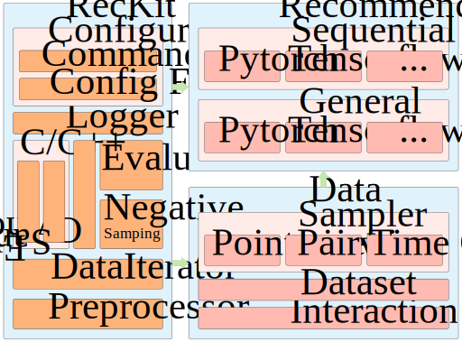

# NeuRec

## An open source neural recommender library

**Main Contributors**: [Bin Wu](https://github.com/wubinzzu), [Zhongchuan Sun](https://github.com/ZhongchuanSun), [Xiangnan He](http://staff.ustc.edu.cn/~hexn/), [Xiang Wang](https://xiangwang1223.github.io), and [Jonathan Staniforth](https://github.com/jonathanstaniforth).

**NeuRec** is a comprehensive and flexible Python library for recommender systems that includes a large range of state-of-the-art neural recommender models.
This library aims to solve general, social and sequential (i.e. next-item) recommendation tasks.
Now, NeuRec supports both [TensorFlow](https://www.tensorflow.org/) and [PyTorch](https://pytorch.org/) libraries.
NeuRec is [open source](https://opensource.org) and available under the [MIT license](https://opensource.org/licenses/MIT).

## Features

- **Flexible configuration** - easily change the configuration settings to your exact requirements;
- **Easy expansion** - quickly include models or datasets into NeuRec;
- **Fast execution** - naturally support GPU, with a multi-thread evaluator;

## Architecture

The architecture of NeuRec is shown in the below:



## Quick Start

Firstly, download this repository and unpack the downloaded source to a suitable location.

Secondly, install [RecKit](https://github.com/ZhongchuanSun/reckit):

```bash
pip install reckit
```

Thirdly, specify dataset and recommender in configuration file *NeuRec.ini*.

Finally, run [main.py](./main.py) in IDE or with command line:

```bash
python main.py
```

## Models

[check_mark]:./doc/img/check_mark.svg

The list of available models in NeuRec, along with their paper citations, are shown below:

| General Recommender | PyTorch | TensorFlow | Paper                                                                   |
|---|:-:|:-:|---|
| BPRMF     |   [![√][check_mark]](./model/general_recommender/pytorch/MF.py)   | [![√][check_mark]](./model/general_recommender/tensorflow/MF.py)  | [Steffen Rendle et al., BPR: Bayesian Personalized Ranking from Implicit Feedback. UAI 2009.](https://dl.acm.org/doi/10.5555/1795114.1795167)    |
|  FISM    |   [![√][check_mark]](./model/general_recommender/pytorch/FISM.py)   | [![√][check_mark]](./model/general_recommender/tensorflow/FISM.py)  | [Santosh Kabbur et al., FISM: Factored Item Similarity Models for Top-N Recommender Systems. KDD 2013.](https://dl.acm.org/doi/10.1145/2487575.2487589)    |
| LightGCN |   [![√][check_mark]](./model/general_recommender/pytorch/LightGCN.py)   | [![√][check_mark]](./model/general_recommender/tensorflow/LightGCN.py)  | [Xiangnan He et al., LightGCN: Simplifying and Powering Graph Convolution Network for Recommendation. SIGIR 2020.](https://dl.acm.org/doi/10.1145/3397271.3401063)    |
| NGCF |   [![√][check_mark]](./model/general_recommender/pytorch/NGCF.py)   | [![√][check_mark]](./model/general_recommender/tensorflow/NGCF.py)  | [Xiang Wang et al., Neural Graph Collaborative Filtering. SIGIR 2019.](https://dl.acm.org/doi/10.1145/3331184.3331267)    |

| Sequential Recommender | PyTorch | TensorFlow | Paper                                                                   |
|---|:-:|:-:|---|
| TransRec |  [![√][check_mark]](./model/sequential_recommender/pytorch/TransRec.py) | [![√][check_mark]](./model/sequential_recommender/tensorflow/TransRec.py)  | [Ruining He et al., Translation-based Recommendation. RecSys 2017](https://dl.acm.org/doi/10.1145/3109859.3109882)  |
|   FPMC   |  [![√][check_mark]](./model/sequential_recommender/pytorch/FPMC.py) | [![√][check_mark]](./model/sequential_recommender/tensorflow/FPMC.py)  | [Steffen Rendle et al., Factorizing Personalized Markov Chains for Next-Basket Recommendation. WWW 2010](https://dl.acm.org/doi/10.1145/1772690.1772773)  |
|   Caser  |  [![√][check_mark]](./model/sequential_recommender/pytorch/Caser.py) | [![√][check_mark]](./model/sequential_recommender/tensorflow/Caser.py)  | [Jiaxi Tang et al., Personalized Top-N Sequential Recommendation via Convolutional Sequence Embedding. WSDM 2018](https://dl.acm.org/doi/10.1145/3159652.3159656)  |

| Social Recommender | PyTorch | TensorFlow | Paper                                                                   |
|---|:-:|:-:|---|
|      |     |      |      |

## Contributions

Please let us know if you experience any issues or have suggestions for new features by submitting an issue under the Issues tab or joining our WeChat Group.


## Acknowledgements

The development of NeuRec is supported by the National Natural Science
Foundation of China under Grant No. 61772475. This project is also supported by the National Research Foundation, Prime Minister’s Office, Singapore under its IRC@Singapore Funding Initiative.


